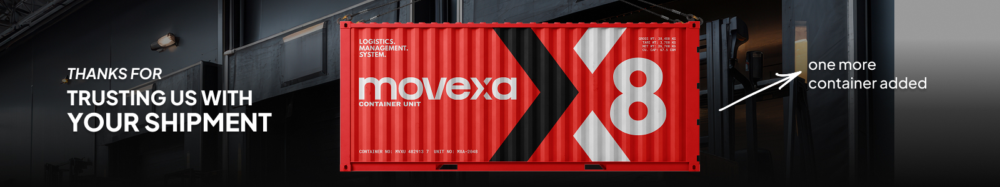
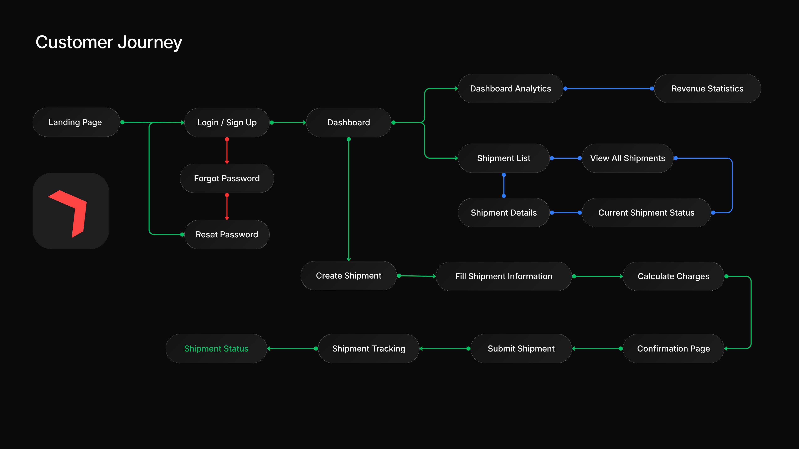
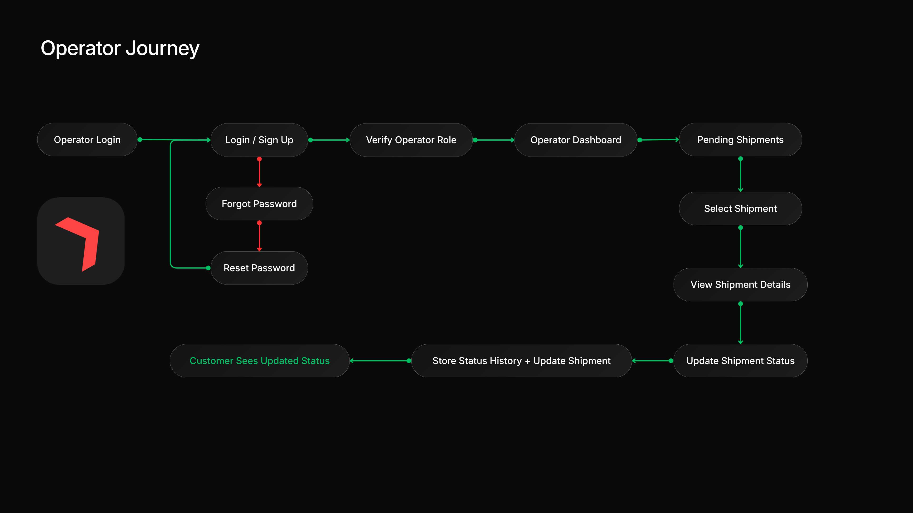

# Movexa Logistics Management System


<p align="center">
  
</p>

Managing logistics should not feel like a puzzle. Movexa is an all-in-one shipment management platform. It is built to simplify individual and team logistics handling.
We simplify the shipping process by bringing creation, tracking, and management into one secure, easy-to-use space.

  ‎ 
<p align="center">

[](https://movexalogistics.vercel.app/)
[](https://movexalogistics.vercel.app/)
[](https://calculusionstudios.mintlify.app/movexalogistics)

</p>

  ‎ ‎ ‎ ‎ 
## 📖 Overview

Movexa is an all-in-one logistics platform designed to simplify how you manage shipments from start to finish.

Instead of juggling separate tools for booking, tracking, and calculating costs, we bring your entire shipping 
workflow into a centralised dashboard. It is built to remove the friction from logistics. Hence, providing you with complete visibility and control over your cargo.

---
  ‎ ‎ ‎ ‎ 
## 📁 Folder Structure

```
MOVEXA LOGISTICS PLATFORM
│
├── 📁 api                              
│   ├── contact-support.js                                  # Handles customer support form submissions via Resend
│   ├── create-shipment.js                                  # Creates new shipment records
│   ├── dashboard-stats.js                                  # Returns dashboard summary statistics
│   ├── get-confirmation.js                                 # Retrieves shipment confirmation details
│   ├── get-shipment-details.js                             # Retrieves detailed shipment information
│   ├── pending-shipments.js                                # Fetches all pending shipments
│   ├── profile.js                                          # Returns authenticated user profile information
│   ├── revenue-stats.js                                    # Calculates shipment revenue statistics
│   ├── shipment-analytics.js                               # Provides shipment analytics data
│   ├── shipment-details.js                                 # Returns shipment list and overview
│   └── update-shipment-status.js                           # Updates shipment delivery status
│
├── 📁 lib                           
│   ├── db.js                                               # PostgreSQL database connection
│   ├── rateLimit.js                                        # Upstash Redis rate limiter
│   └── supabaseAdmin.js                                    # Supabase Admin SDK configuration
│
├── 📁 node_modules                                         # Installed project dependencies
│
├── 📁 public                       
│   │
│   ├── 📁 animations                                       # Lottie animation assets
│   ├── 📁 assets                                           # Logos, illustrations and branding assets
│   ├── 📁 css                                              # Tailwind CSS input and compiled styles
│   ├── 📁 error-backgrounds         
│   ├── 📁 favicon                    
│   ├── 📁 maincontenticons           
│   ├── 📁 sidebaricons               
│   │
│   ├── 📁 js                        
│   │   ├── auth-guard.js                                   # Protects authenticated pages
│   │   ├── confirmation.js                                 # Confirmation page functionality
│   │   ├── dashboard.js                                    # Dashboard data and interactions
│   │   ├── forgot-password.js                              # Forgot password workflow
│   │   ├── google-auth.js                                  # Google sign-in integration
│   │   ├── loading.js                
│   │   ├── login.js                                        # User login handling
│   │   ├── logout.js                                       # User logout functionality
│   │   ├── operator.js                                     # Operator dashboard interactions
│   │   ├── profile.js                                      # Loads authenticated user profile
│   │   ├── redirect.js               
│   │   ├── reset-password.js                               # Password reset workflow
│   │   ├── shipment-detail.js                              # Shipment details page logic
│   │   ├── shipment-processing.js    
│   │   ├── shipment.js                                     # Shipment creation logic
│   │   ├── shipmentanalytics.js                            # Shipment analytics page
│   │   ├── signup.js                                       # User registration
│   │   ├── smooth-scroll.js          
│   │   ├── supabase.js                                     # Supabase client configuration
│   │   ├── support.js                                      # Support page interactions
│   │   ├── tracking.js                                     # Shipment tracking functionality
│   │   ├── transitions.js            
│   │   └── usage-policy.js                                 # Usage Policy page navigation
│   │
│   ├── 404.html                                            
│   ├── addshipment.html                                    # Shipment creation page
│   ├── confirmation.html                                   # Shipment confirmation page
│   ├── dashboard.html                                      # Customer dashboard
│   ├── delivery-coverage-shipping-rates.html               # Delivery coverage and shipping calculator
│   ├── documentation-centre.html                           # Platform documentation centre
│   ├── forgot-password.html                                # Password recovery page
│   ├── index.html                                          # Landing page
│   ├── loading.html                                        # Shipment loading screen
│   ├── login.html                                          # User login page
│   ├── no-shipment.html                                    # Invalid shipment page
│   ├── operator.html                                       # Operator dashboard
│   ├── redirect.html                                       
│   ├── reset-password.html                                 # Password reset page
│   ├── shipment-detail.html                                # Shipment details page
│   ├── shipment-processing.html                            # Shipment processing page
│   ├── shipmentanalytics.html                              # Shipment analytics dashboard
│   ├── shippingpage.html                                   # Shipment management page
│   ├── support.html                                        # Customer support centre
│   ├── tracking.html                                       # Shipment tracking page
│   ├── underdev.html                                       
│   └── usage-policy.html                                   # Platform usage policy
│
├── 📁 validations                                          # Backend input validation schemas
│
├── .gitignore                                         
├── package-lock.json                
├── package.json                     
└── vercel.json                      
```
---
  ‎ ‎ ‎ ‎ 
## 📌 User & Operator Journey Flow

<p align="center">
  
</p>

<p align="center">
  
</p>

---
  ‎ ‎ ‎ ‎ 

## 🛠 Technology Stack

### ⟶ 1️⃣ UI / UX & Design

| Technology | Purpose | Description |
|:-----------|:--------|:------------|
| Figma | UI/UX Design | Designed wireframes, user flows, and high-fidelity interface prototypes. |
| Google Fonts | Typography | Provides clean, modern typography for a consistent user experience. |
| Lucide Icons | Icon Library | Lightweight SVG icons used throughout the dashboard interface. |
| Lottie Animations | Animations | Displays smooth loading and transition animations. |


### ⟶ 2️⃣ Frontend

| Technology | Purpose | Description |
|:-----------|:--------|:------------|
| HTML5 | Structure | Defines the semantic structure of all web pages. |
| CSS3 | Styling | Adds custom layouts, styling, and visual enhancements. |
| Tailwind CSS v4 | UI Framework | Utility-first CSS framework for rapid interface development. |
| JavaScript (ES6) | Client-side Logic | Powers interactive features and dynamic user interactions. |


### ⟶ 3️⃣ Backend

| Technology | Purpose | Description |
|:-----------|:--------|:------------|
| Node.js | Runtime | Executes server-side JavaScript for backend operations. |
| Vercel Serverless Functions | APIs | Hosts scalable serverless backend API endpoints. |


### ⟶ 4️⃣ Database & Authentication

| Technology | Purpose | Description |
|:-----------|:--------|:------------|
| Neon PostgreSQL | Cloud Database | Managed PostgreSQL database hosted on Neon. |
| PostgreSQL | Data Storage | Stores shipment, customer, and operational information. |
| Supabase Auth | Authentication | Handles secure user authentication and session management. |
| Google OAuth | Social Login | Allows users to securely sign in with Google. |


### ⟶ 5️⃣ Security & Validation

| Technology | Purpose | Description |
|:-----------|:--------|:------------|
| Zod | Validation | Validates API requests and user input before processing. |
| Upstash Redis | Data Store | Provides cloud Redis for distributed services. |
| Upstash Ratelimit | Rate Limiting | Protects APIs against spam and excessive requests.‎ |


### ⟶ 6️⃣ Services & Deployment

| Technology | Purpose | Description |
|:-----------|:--------|:------------|
| Resend | Email Service | Sends transactional and customer support emails. |
| Better Stack | Monitoring | Monitors uptime and service availability. |
| Vercel | Deployment | Deploys the application using a global edge network. |


### ⟶ 7️⃣ Development Tools

| Technology | Purpose | Description |
|:-----------|:--------|:------------|
| Git | Version Control | Tracks project changes throughout development. |
| GitHub | Repository Hosting | Stores source code and manages version history. |

---
  ‎ ‎ ‎ ‎ 
  ‎ ‎ ‎ ‎ 
## 🚀 Run Locally

```bash
# Clone the repository
git clone https://github.com/calculusion/movexa.git

# Navigate to the project
cd movexa

# Install dependencies
npm install

# Create a .env file in the project root and add:
DATABASE_URL=
SUPABASE_URL=
SUPABASE_ANON_KEY=
SUPABASE_SERVICE_ROLE_KEY=
RESEND_API_KEY=
SUPPORT_EMAIL=

# Build Tailwind CSS
npm run build:css

# Watch CSS (optional)
npm run watch:css

# Start the development server
npm run dev

# Open in your browser
# http://localhost:3000
```
---‎
  ‎ ‎ ‎ ‎ ‎
## 📚 Project Documentation

> Explore the complete technical documentation for Movexa on **Mintlify**.

[](https://calculusionstudios.mintlify.app/movexalogistics)

---
  ‎ ‎ ‎
## 📜 Usage Policy

> Review the usage guidelines, acceptable use, and user responsibilities for the Movexa Logistics platform.

[](https://calculusionstudios.mintlify.app/usage-policy)

---
Copyright © 2026 Ayush Giri. All rights reserved.
> This repository is provided for educational and portfolio purposes only. Unauthorised copying, modification, redistribution, or commercial use of the source code is prohibited without prior written permission.

